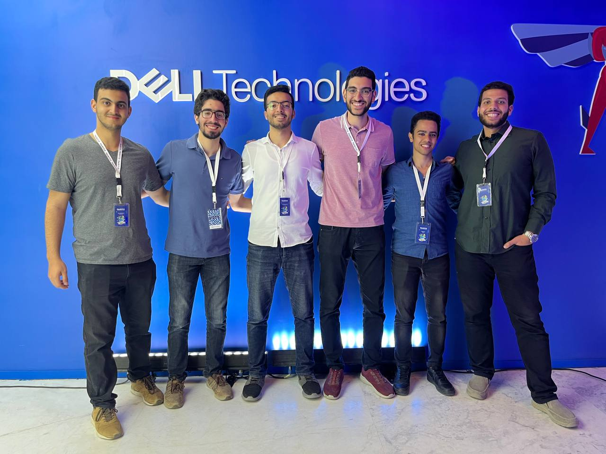

# Maze Solver and Child Rescuer

This is a project created for the Dell HackTrick2023 hackathon. The project involves solving a maze and rescuing children in the maze by solving cyber security riddles.

## Story

Initially, we attempted to use Stable Baselines to train a reinforcement learning (RL) agent, but we quickly encountered compatibility issues with the maze environment. Undeterred, we decided to build a Deep Q-Network (DQN) algorithm from scratch using PyTorch. Unfortunately, we faced another setback as the training didn't converge, leaving us no choice but to explore other avenues.

Determined to overcome these obstacles, we opted for an algorithmic approach to solve the maze. The cybersecurity team was instrumental in the success of our project, working tirelessly to crack the riddles and unlock the paths to the children. We are immensely grateful for their efforts and contributions.

Thanks to their tireless problem-solving skills, the children were rescued, and the maze was ultimately conquered. Of course, we faced numerous challenges and bugs along the way, but our team spirit and collaboration were key to our ultimate triumph.

We are grateful for the opportunity to participate in this hackathon and proud to have contributed to its success. Thank you, Dell Center of Excellence, for this unforgettable experience. And a special thank you to the problem-solving team for their invaluable support and hard work.

Also you can check our [Testomonial video](https://drive.google.com/file/d/1LxfVQ65y8XL_YCMNslwYWoG3N1_UGquq/view?usp=sharing) from here.

## usage

Create a virtual environment and install the requirements using the following command:

`conda env create -f Hacktrick23_env.yml`

Activate the environment using the following command:

`conda activate Hacktrick23`

Run the following command to run the project:

`python .\gym-maze\local_solver_with_exit.py`

## Project Description

### Problem Statement

The year is 2023. A group of children have been kidnapped and locked in a maze. The only way to rescue them is to solve the riddles and unlock the paths to the children. The maze is surrounded by a high-tech security system that will not allow anyone to enter or exit the maze. The only way to solve the riddles is to hack into the security system and crack the codes. The only way to crack the codes is to solve the riddles. The only way to solve the riddles is to hack into the security system.

### Solution

Our solution is a combination of AI and ML algorithms and cybersecurity techniques. The AI and ML algorithms are used to solve the maze and rescue the children. The cybersecurity techniques are used to hack into the security system and crack the codes.

### Approach

#### AI, RL and an algorithmic approach

We used a Deep Q-Network (DQN) algorithm to solve the maze. The DQN algorithm is a reinforcement learning algorithm that uses a neural network to learn the optimal policy for a given environment. The neural network is trained using the Q-learning algorithm. The Q-learning algorithm is an off-policy reinforcement learning algorithm that uses a table to store the Q-values for each state-action pair. The Q-values are updated using the Bellman equation. The neural network is trained using the Q-values stored in the table. The neural network is used to predict the optimal action for a given state. The optimal action is then taken and the environment is updated. The process is repeated until the optimal policy is learned.

The RL approach didn't work as expected, so we decided to use an algorithmic approach to solve the maze. The algorithmic approach is based on the following steps:

1. Read the maze from the input file.
2. Find the shortest path from the starting point to the exit.
3. Find the shortest path from the exit to the children.
4. Find the shortest path from the children to the exit.
5. Repeat steps 2, 3 and 4 until all the children are rescued.

#### Cybersecurity

There are four types of riddles to solve in the maze:

1. An amazon Captcha, which needs to be solved using OCR.
2. A jwt token that needs to be decoded, edited to make the user an admin, and then encoded again.
3. A Cipher text that needs to be decrypted.
4. A Pcap file that needs to be analyzed to find the flag.

Our approach to solve them can be found in [gym-maze\riddle_solvers.py](gym-maze/riddle_solvers.py).

## Project Structure

### AI and ML

The AI and ML part of the project is located in the [WorkingDQN](WorkingDQN) directory. The `WorkingDQN` directory contains the final Algorithim that we reached before switching to the algorithmic approach. it can be found in the [WorkingDQN\FinalDQN.ipynb](WorkingDQN/FinalDQN.ipynb) file.

### Algorithmic Approach

The algorithmic approach is located in the `gym-maze` directory. The local solver can be found in the [gym-maze\local_solver_with_exit.py](gym-maze/local_solver_with_exit.py) file. The remote solver can be found in the [gym-maze\submission_solver.py](gym-maze/submission_solver.py) file.

## Contributors

### Problem Solving Team

- [Anton Ashraf](https://github.com/AntonAshraf)
- [Mahmoud Hany](https://github.com/MahmoudHanyFathalla)

### Cybersecurity Team

- [Medhat Hassan](https://github.com/MedhatHassan)
- [Moaz Salem](https://github.com/mooazsalem201)

### AI and ML Team

- [Ahmed Kamal](https://github.com/AhmadKamal0)
- [Omar Ahmed](https://github.com/OmarAhmed-A)
